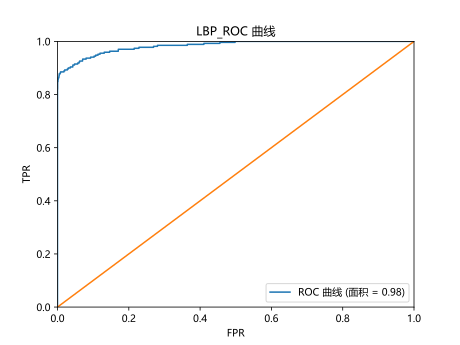
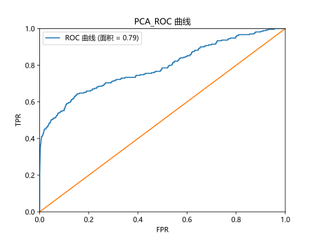
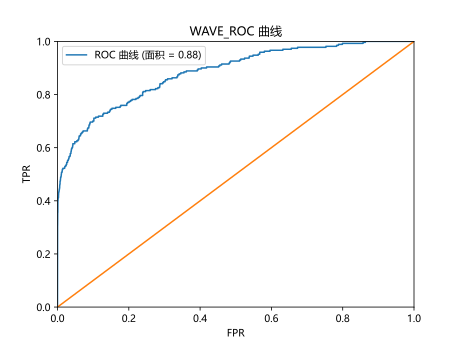
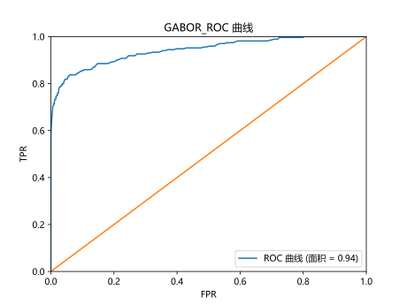
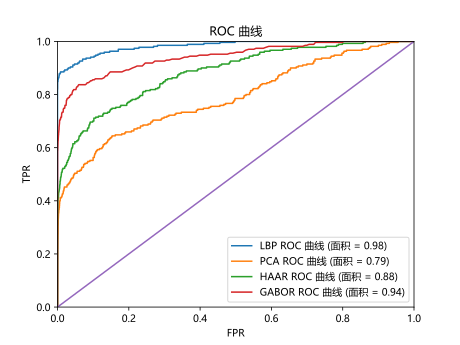

# 作业内容

在课程资料库中下载相应的图库，完成特征提取，分类的识别，要求画出ROC曲线，选择几种算法进行对比。时间2周，
自己做自己的。上交的是一篇小论文，里面有理论，有执行结果，有准确率对比就可以。

## 数据集的选择

本次代码选择了*掌纹.zip*作为数据集, 并解压图片到dataset目录下

> 根目录
> > dataset
>> > 000001.bmp
>
>> > 000002.bmp
>
>> > 000003.bmp

# 说明

1. `main.py`用于将所有算法的数据绘制到一张图像上
2. `model.py`分离出Model类, 统一了绘制ROC接口, 初始化加载数据集, 计算softmax
3. 运行不同算法, 只需运行对应的`*_model.py`文件

## LBP算法

> 准确率: 0.88

## PCA算法

> 准确率: 0.52

## Haar小波变换

> 准确率: 0.59

## Gabor变换

> 准确率: 0.80

# 算法对比

| 算法    | 准确率  |
|-------|------|
| LBP   | 0.99 |
| PCA   | 0.52 |
| Haar  | 0.59 |
| Gabor | 0.80 |

